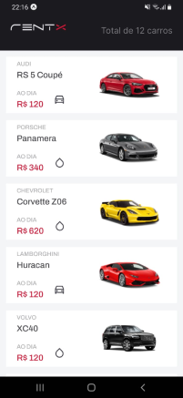
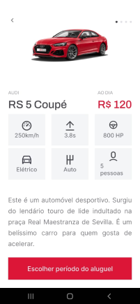
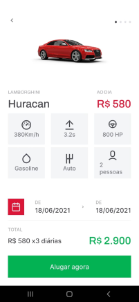

# rentx
Car rental app. In progress...

## Technologies
- React Native
- Typescript
- Expo Bare Workflow
- Styled Components

## Run app
- Change the variable baseURL in the src/services/api.ts file to your IP 

Ex: baseURL: 'http://{YOUR IP HERE}:3333',

- Run the following commands:

json-server ./src/services/server.json --host {YOUR IP HERE} --port 3333 —delay 700

expo start
